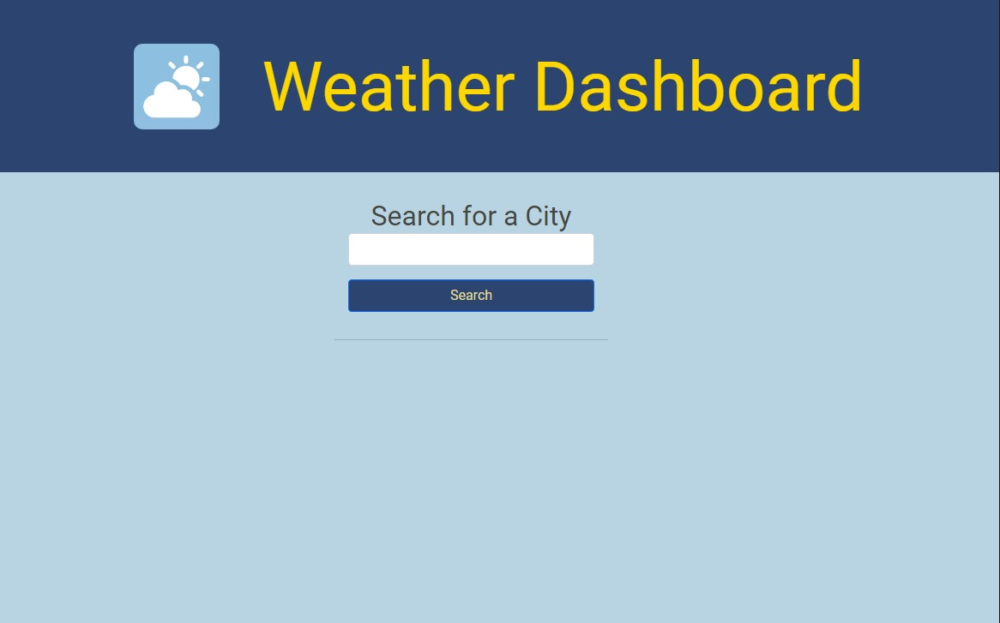
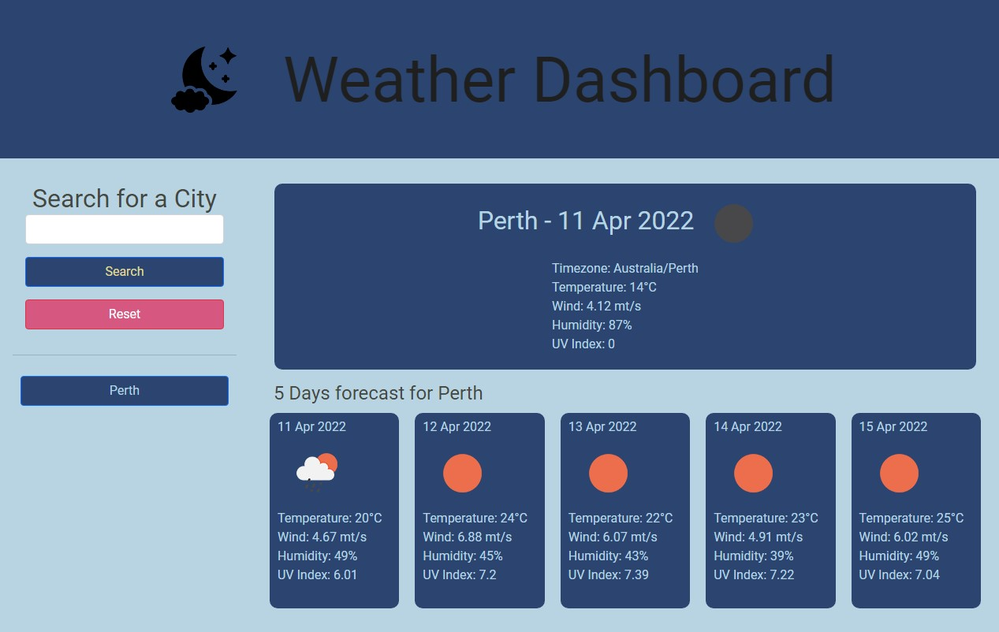
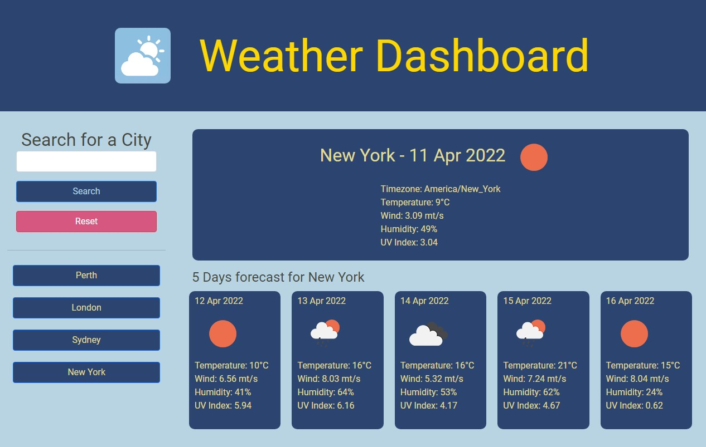
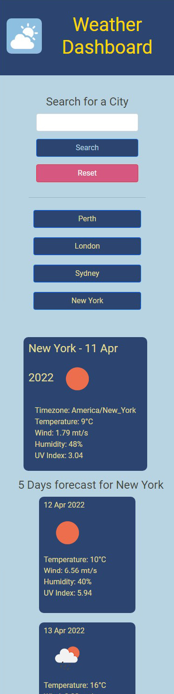
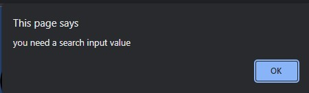
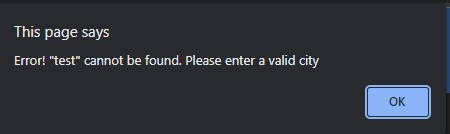

# Weather Dashboard

## The App
This is a web application that enables a user to find out the current weather and five days forecast of cities of their choice. The history of the cities searched is available. The chosen city's display has two modes: 
1. Daytime: When the current time is after sunrise and before sunset, the main icon displays a "cloud and sun" image, and colour styles are brighter.
2. Night time: When the current time is after sunset and before sunrise, the main icon displays a "cloud and moon" image, and colour styles are dimmer.

The app is responsive

## The Webpage
The webpage is a single page application and it contains: 
- A main heading with a weather icon
- An input field to search for cities
- A search button
- A reset button
- Search history for previous cities searched
- The current weather for the chosen city. It contains the following data:
1. City location and current date
2. Icon image representating the current weather
3. Timezone location
4. Temperature (degree celcius)
5. Wind speed (meter/second)
6. Humidity (percentage)
7. UV index
- A five days forecast for the chosen city. Each day contains the following data: 
1. The forecast date
2. Icon image representating the forecast weather
3. Temperature (degree celcius)
4. Wind speed (meter/second)
5. Humidity (percentage)
6. UV index

## Technologies
API - OpenWeather API: https://openweathermap.org/api  
JavaScript, HTML, CSS

## How it works
The page starts with
- An input with a search button

 
 

- When the user submits a city name, the city name is saved in the history. The current weather and a five day forecast are displayed. In this example we used Perth as the city location and since the current time is after sunset and before sunrise, the weather icon next to the heading is a dark "cloud and moon". The text style is dimmer.
   
 
 

- After multiple city search, they are saved in the history where the user can click and the weather information will be displayed. In this example we used New York as the city location. Since it is daytime, the weather icon is a bright "cloud and sun". The text stule is lighter. 
   
 
 

- The website is responsive and can be viewed on different devices  
   
 
 

- Press reset button to clear the search history and go back to the start page.
 
 

- If the search input is empty, the following alert is prompted:  

 
 

- If the search input is not found or invalid, the following alert is prompted:  

 
 

## Link to deployment application
https://bernardjbs.github.io/hw-boot-wk06-Weather-Dashboard/